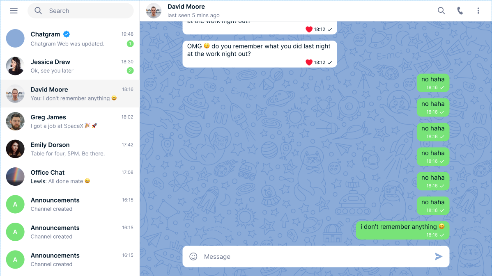

# 10_gonggang_mate_front

해달앱동-해커톤 힝힝힝조 프로젝트입니다.

# 공강놀이 매칭 웹페이지

## 소개

이 프로젝트는 대학생들을 위한 공강 시간에 함께 놀 수 있는 친구를 매칭해 주는 웹페이지입니다.

로그인, 회원가입, 시간표 등록, 친구 매칭 및 채팅, 그리고 게시판 기능을 제공하여 학생들 간의 소통과 활동을 도모합니다.

## 역할분담

-front_end : 김두현, 김민환
-back_end : 유승욱, 김준혁

## 주요 기능

### 1. 로그인/회원가입

- 사용자는 계정을 생성하고 로그인하여 서비스를 이용할 수 있습니다.
  

### 2. 시간표 등록

- 사용자는 자신의 공강 시간을 시간표에 등록할 수 있습니다.
  

### 3. 친구 매칭/채팅

- 등록된 시간표를 기반으로 서로의 공강 시간이 겹치는 사용자들끼리 매칭되어 친구가 될 수 있습니다.
- 매칭된 친구들은 채팅 기능을 통해 소통할 수 있습니다.
  

### 4. 게시판

- 사용자들은 자유롭게 글을 작성하고 읽을 수 있는 게시판이 제공됩니다.
  

## 기술 스택

- 프론트엔드: HTML, CSS, JavaScript
- 백엔드: spring, JPA
- 데이터베이스: MySQL

## 설치 및 실행

1. 저장소를 클론합니다.
   ```bash
   git clone https://github.com/your-username/your-repository.git
   cd your-repository
   ```
